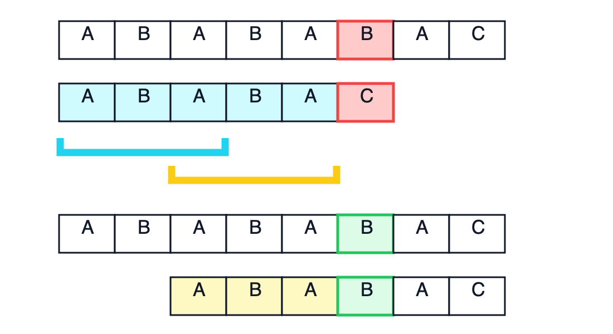
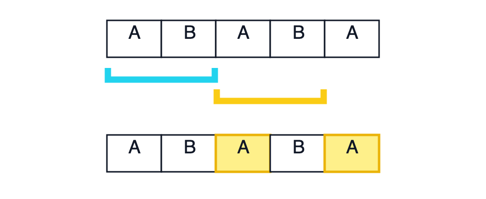
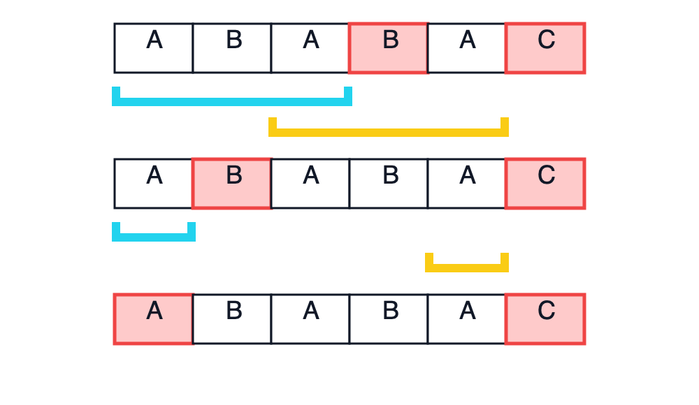

# KMP

由于经常学了就忘，还是决定整理一下笔记，相信详细梳理之后应该就不会忘了。

## 什么是 KMP？
先来看一道题：

> 给出两个字符串 $s_1$ 和 $s_2$，若 $s_1$ 的区间 $[l, r]$ 子串与 $s_2$ 完全相同，则称 $s_2$ 在 $s_1$ 中出现了，其出现位置为 $l$。  
> 现在请你求出 $s_2$ 在 $s_1$ 中所有出现的位置。
>
> 对于全部的测试点，保证 $1 \leq |s_1|,|s_2| \leq 10^6$，$s_1,s_2$ 中均只含大写英文字母。

我们很容易就能想到 $\mathcal{O}(|s_1|\cdot|s_2|)$ 的暴力：  
循环枚举 $i$（$1\le i\le|s_1|-|s_2|+1$），检查 $s_1[i\ldots i+|s_2|-1]$ 是不是 $s_2$，如果是就输出 $i$（使用 `1-based` 下标）。无论本次是否匹配成功，之后都从 $i+1$ 开始检查下一个可能的起点。

但是注意到 $1 \leq |s_1|,|s_2| \leq 10^6$，这种方法显然会超时。  
于是就有三位大神提出了另一种以 $\mathcal{O}(|s_1|+|s_2|)$ 时间复杂度解决这种匹配字符串的问题的算法，叫做 **KMP**。

::: details 小知识

KMP 算法由三位计算机科学家共同提出：

- Donald Knuth
- James H. Morris
- Vaughan Pratt

KMP 就是三人姓氏首字母的组合。

:::

## KMP 的核心思想

举个栗子，文本串和模式串分别为：

```text
文本串：A B A B A B A C
模式串：A B A B A C
                ↑
```

前 $5$ 个字符 `ABABA` 已经对上了，但是到第 $6$ 个字符时文本串中的 `B` 和模式串中的 `C` 不一样，发生了失配。

如果暴力就会先把模式串向右移动一位，然后再从第一个字符重新比较。但是，之前的比较已经告诉了我们文本串中的这一段内容是 `ABABA`，重新逐个比较其中的字符显然有些浪费。

观察一下已经匹配成功的部分 `ABABA`：

```text
ABABA
^^^    前缀 ABA
  ^^^  后缀 ABA
```

它的**真前缀** `ABA` 和**真后缀** `ABA` 相同。所以如果失配了，就可以直接把模式串开头的 `ABA` 移动到真后缀 `ABA` 的位置。

```text
文本串：A B A B A B A C
模式串：    A B A B A C
```

这样前面的 `ABA` 就不需要重新比较，可以直接从后面的字符继续匹配。

::: details 真前缀与真后缀

对于一个字符串 $s$，从第一个字符开始连续选取若干个字符得到的字符串称为
$s$ 的前缀。比如字符串 `ABA` 的所有非空前缀为：

```text
A
AB
ABA
```

如果一个前缀不等于字符串本身就称它为**真前缀**。所以 `ABA` 的所有非空真前缀就是：

```text
A
AB
```

后缀同理，字符串 `ABA` 的所有非空后缀为：

```text
A
BA
ABA
```

`ABA` 的所有非空**真后缀**为：

```text
A
BA
```

如果一个字符串没有非空的相同真前后缀，就把长度记为 $0$。下文的前缀与后缀都指真前缀与真后缀。

:::

在匹配失败时利用已经匹配部分的最长相同前后缀，把模式串移动到下一个可能匹配成功的位置就是 KMP 的核心思想。这样文本串的下标就不需要向前回退了。下面看看具体怎么操作。

## 具体实现

定义 $nxt[i]$ 表示 $p[1\ldots i]$ 的最长相同真前后缀长度。以 `"ababaca"` 为例：

| $i$ | $nxt[i]$ | 最长相同真前后缀 |
| :---: | :---: | :---: |
| 1 | 0 | `""` |
| 2 | 0 | `""` |
| 3 | 1 | `"a"` |
| 4 | 2 | `"ab"` |
| 5 | 3 | `"aba"` |
| 6 | 0 | `""` |
| 7 | 1 | `"a"` |

其中 `i=5` 时的前后缀关系可以画成：


> 青色和黄色分别标出了真前缀与真后缀 `ABA`。

其中 `nxt[i]=0` 表示 $p[1\ldots i]$ 没有非空的相同真前后缀，表格中的 `""` 表示空字符串。后面用 $j$ 表示模式串已经匹配好的长度，$p[1\ldots j]$ 已经对上了，下一个要比较的字符就是 $p[j+1]$。

先不管这个数组怎么算，先看看要怎么用这个数组。还是用刚才的失配例子：



> 上半部分的红色方框表示失配位置，青色和黄色分别标出相同的前后缀；下半部分的绿色方框表示下一次比较的位置。

失配前已经匹配了 `ABABA`，所以此时 $j=5$。由于 `nxt[5]=3`，模式串开头的 `ABA` 可以与已匹配部分末尾的 `ABA` 对齐，于是直接令 `j=3`。

文本串的位置不用动，还是拿刚才失配的第 $6$ 个字符 `B` 与新的 $p[j+1]$ 比较，也就是模式串的第 $4$ 个字符 `B`。这两个字符相同，可以接着往后匹配。

如何把这个串的前缀移动到后缀的位置呢？很简单，设当前已经匹配好的长度为 $j$，我们知道后缀的长度是 $nxt[j]$，所以它的开头位置就是 $j-nxt[j]+1$。同时，前缀的开头是模式串第一个字符的位置，所以后缀与前缀的距离就是 $j-nxt[j]+1-1=j-nxt[j]$。每次失配只需要把模式串向右移动 $j-nxt[j]$ 个位置再继续匹配。如果移动后仍然失配，就继续尝试更短的相同真前后缀，直到当前字符匹配成功或者 $j=0$。

实现的时候不需要真的移动模式串。模式串向右移动 $j-nxt[j]$ 位就相当于直接设置 `j=nxt[j]`，表示保留前 `nxt[j]` 个已经匹配的字符，然后继续用文本串当前的字符进行匹配。

知道了 `nxt` 怎么用之后就要讲它怎么求了。

我们从左到右计算，长度为 $1$ 的字符串没有非空真前后缀，所以 `nxt[1]=0`。计算 `nxt[i]` 时，前面的 `nxt[1]` 到 `nxt[i-1]` 都已经算好了。令 `j=nxt[i-1]`。这时有 $p[1\ldots j] = p[i-j\ldots i-1]$。想知道这组前后缀能不能再延长一位，只需要比较 $p[j+1]$ 和 $p[i]$。

如果 `p[j+1]==p[i]`，原来的前后缀就可以延长一个字符，设置 `nxt[i]=j+1`。比如计算 `p="ababa"` 的 `nxt[5]`，已经知道 `nxt[4]=2`，长度为 $2$ 的相同真前后缀是 `ab`。



> 青色前缀与黄色后缀都是 `AB`，绿色标出的两个字符又都是 `A`，因此可以延长为 `ABA`，得到 `nxt[5]=3`。

但是当 `p[j+1]!=p[i]` 时就说明长度为 $j$ 的相同真前后缀无法继续延长。

但是，这**并不代表不存在更短的相同真前后缀**。我们还需要继续试试 $j=nxt[j]$，因为 $p[1\ldots j]$ 已经匹配成功了，想保留其中一部分，这一部分就必须既是它的前缀，也是它的后缀。下一个能尝试的最长长度正好是 `nxt[j]`，所以令 `j=nxt[j]`。

如果还是失配，就继续执行：

```cpp
j=nxt[j];
```

直到找到能够匹配的位置，或者 `j=0`。

比如计算 `p="ababaca"` 的 `nxt[6]`，一开始有 `j=nxt[5]=3`：



> 三行依次对应 `j=3`、`j=1` 和 `j=0`。青色与黄色表示当前候选前后缀，红色方框表示本轮比较仍然失配。

三次比较都失败，所以 `nxt[6]=0`。代码中的 `while` 做的就是这个不断缩短前后缀的过程。

匹配时如果 `j==m`，说明整个模式串都对上了。这次匹配在文本串的第 $i$ 个字符结束，起点就是 $i-m+1$。

输出答案后不能直接设置 `j=0`，因为两次匹配可能会重叠。比如模式串 `AAA` 在文本串 `AAAAA` 中出现的位置是 $1,2,3$。设置 `j=nxt[j]` 就可以保留结尾处已经匹配好的部分，接着寻找下一次匹配。

把上面的过程合起来就是下面的代码。

## 代码
```cpp
#include<bits/stdc++.h>
using namespace std;

const int N=1000005;
int nxt[N]; //记录最长相同真前后缀长度

int main()
{
    string s,p;
    cin>>s>>p;//s是文本串 p是模式串

    s=" "+s;//1-based下标
    p=" "+p;
    int n=s.size()-1;
    int m=p.size()-1;

    for(int i=2,j=0;i<=m;i++)
    {
        while(j&&p[i]!=p[j+1])j=nxt[j];//只要新一项不相等就不断缩小范围到更短的前后缀
        if(p[i]==p[j+1])j++;//如果新的位置和前缀的下一项相同就把长度增加1
        nxt[i]=j;//设置nxt数组
    }

    for(int i=1,j=0;i<=n;i++)
    {
        while(j&&s[i]!=p[j+1])j=nxt[j];//只要新一项匹配不上就不断缩小范围到更短的前后缀
        if(s[i]==p[j+1])j++;//如果匹配上了就把要匹配的位置设为下一项

        if(j==m)//模式串匹配完了
        {
            cout<<i-m+1<<"\n";//在i-m+1开头的位置出现了一次模式串
            j=nxt[j];//再回到前缀结尾继续匹配
        }
    }
    return 0;
}
```

## 复杂度分析

构造 `nxt` 数组时，$i$ 只会从左到右移动。每轮循环最多让 $j$ 增加 $1$，而 `while` 每执行一次都会让 $j$ 减小。$j$ 总共增加的次数不超过 $|p|$，所以它总共减小的次数也不会超过 $|p|$，时间复杂度就是 $\mathcal{O}(|p|)$。

匹配时也是一样的。文本串下标 $i$ 不会回退，$j$ 增加和减小的总次数都不会超过 $|s|$，所以匹配的时间复杂度为 $\mathcal{O}(|s|)$。

两部分加起来，KMP 的总时间复杂度为：

$$
\mathcal{O}(|s|+|p|)
$$

`nxt` 数组保存了模式串每个前缀的答案，空间复杂度为 $\mathcal{O}(|p|)$。

## 最短循环节

### [P4391 [BalticOI 2009] Radio Transmission 无线传输](https://www.luogu.com.cn/problem/P4391)

这道题需要用 `nxt` 数组求字符串的最短循环节。

设字符串长度为 $n$，答案就是 $n-nxt[n]$。比如 `ababab` 的最长相同真前后缀是 `abab`，长度为 $4$，最短循环节长度就是 $6-4=2$，也就是 `ab`。

为什么可以这样算呢？把最长的相同前后缀对齐，前缀需要向右移动的距离正好是 $n-nxt[n]$。移动之后，重叠部分完全相同，这个距离就是一个循环节长度。

如果还能移动得更少，重叠部分就会更长，也就能找到一组比 `nxt[n]` 更长的相同真前后缀，这显然不可能。所以 $n-nxt[n]$ 就是最短的。

这道题允许最后一个循环不完整。比如 `ababa` 也可以看成 `ab` 不断重复后得到的前缀，所以直接输出 `n-nxt[n]`，不用判断它能不能整除 $n$。如果题目要求原字符串必须由若干个完整循环节拼成，就要再加上这个判断：

```cpp
int ans=n-nxt[n];
if(n%ans!=0)ans=n;
```

代码也很短：

```cpp
for(int i=2,j=0;i<=n;i++)
{
    while(j&&s[i]!=s[j+1])j=nxt[j];
    if(s[i]==s[j+1])j++;
    nxt[i]=j;
}
cout<<n-nxt[n];
```
